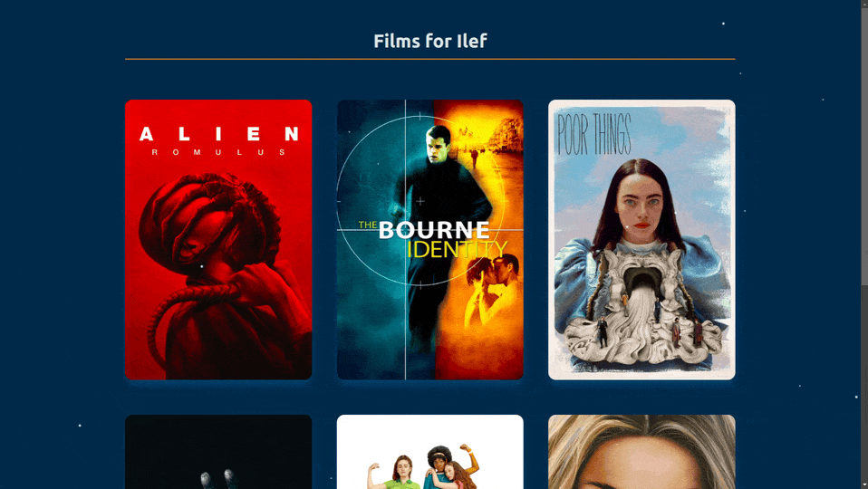

# Films for you

A small "one-off" holiday project that is a small list of film recommendations for my dear friend, Ilef.

---

Though relatively small, I used this project to learn an apply a few new tools including:

- Building APIs with [FastAPI](https://fastapi.tiangolo.com/) (and comparing that to [Flask](https://flask.palletsprojects.com/en/stable/), from which I came)
- Loding skeleton libraries in React ecosystem
- Particle libraries in the React ecosystem
- Hosting a one-page site (on [Render](https://render.com/), at the time of writing)
